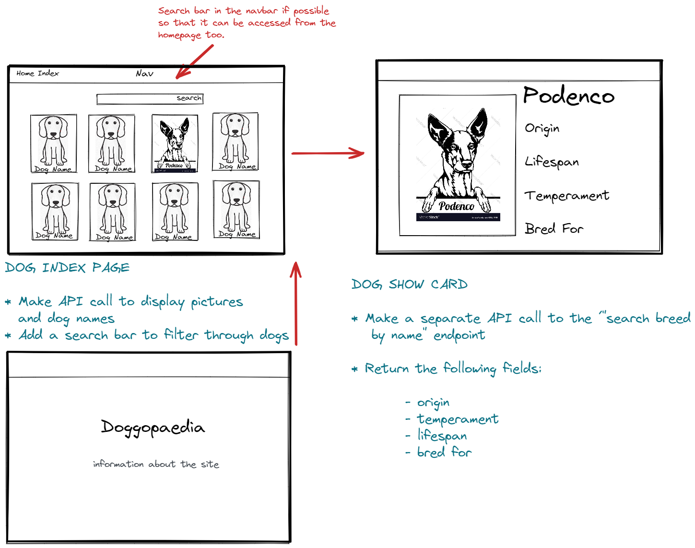

## Project Overview

Doggopedia was conceived as a group due to our mutual love of dogs. I'm a dog lover and proud owner of rescued Podenco from Spain. Thus the free encyclopedia of dogs was born...

[Enter Site Here](https://doggopedia2.netlify.app/dogs/)

### Brief

- Consume a public API
- Have several components - At least one classical and one functional
- The app should include a router - with several "pages"
- Be deployed online and accessible to the public
- Techonologies Used
- JavaScript (ES6)
- React JS usung functions
- Git/ GitHub
- SCSS
- Bulma
- Axios
- Postman

### APIs used:

TheDogApi

### The Process

#### Day 1

After being told the previous night to research different free APIs, I tested some endpoints on Postman to see what json data was returned. The following morning I was grouped with two colleagues and we began testing the Dog-API endpoints. We decide that an encyclopedia of dogs would be a fun project we all had an interest in. We dedicated the morning to whiteboarding and planning the website (pictured).

We continued to work as a team to get the basic functionality and aesthetic up and running. That evening I added some wallpaper to improve the look and feel of the site

#### Day 2

On day 2 we had a website which returned a list of dogs which could be clicked to display more detailed information about each breed. I was tasked with building a search bar at the top of the page. I had difficulty returning the correct data, however I found a different endpoint which allowed search by breed. I made a function which would filter through the breeds using an on change event listener. I had a problem in a previous homework where id didn’t really work and wanted the chance to rectify it. The solution to this was to use the .toLowerCase method on both the input and dog map function.

