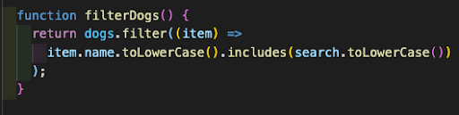
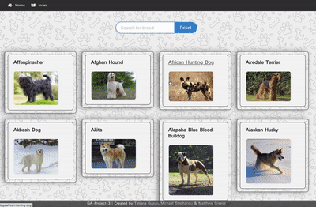

## Project Overview

Doggopedia was conceived as a group due to our mutual love of dogs. I'm a dog lover and proud owner of rescued Podenco from Spain. Thus the free encyclopedia of dogs was born...

[Enter Site Here](https://doggopedia2.netlify.app/dogs/)

### Brief

- Team project with two other colleagues
- 2 days to build
- Consume a public API
- Have several components - At least one classical and one functional
- The app should include a router - with several "pages"
- Be deployed online and accessible to the public

### Techonologies Used

- JavaScript (ES6)
- React JS usung functions
- Git/ GitHub
- SCSS
- Bulma
- Axios
- Postman

### APIs used:

TheDogApi

### The Process

#### Day 1

After being told the previous night to research different free APIs, I tested some endpoints on Postman to see what json data was returned. The following morning I was grouped with two colleagues and we began testing the Dog-API endpoints. We decided that an encyclopedia of dogs would be a fun project we all had an interest in. We dedicated the morning to whiteboarding and planning the website (pictured).

We continued to work as a team, using Zoom and Slack to get the basic functionality and aesthetic up and running. We then pushed this first iteration of the project up to GitHub and pulled down the code to our local machines. This meant we could work on our own individual features and utilize our time better. That evening I added some wallpaper to improve the look and feel of the site.

#### Day 2

On day 2 we had a website which returned a list of dogs which could be clicked to display more detailed information about each breed. I was tasked with building a search bar at the top of the page. I had difficulty returning the correct data, however, I found a different endpoint which allowed search by breed. I made a function which would filter through the breeds using an on change event listener. I had a problem in a previous homework where it didn’t really work and wanted the chance to rectify it. The solution to this was to use the .toLowerCase method on both the input and dog map function.

### Bugs

Given the scope of the project, there aren't any huge standout bugs. However there is a problem with some of the Sass styling which means the wallpaper from the site doesn’t render at full height on one of the web pages. Another issue, which isn’t a bug as such, is the fact that the API doesn’t return all fields for each breed of dog. Therefore we decided as a team that we would not include fields that were unpopulated, on the specific dog breed page. Therefore it looks a little bit sparse and has limited use for the user.

### Challenges

The biggest challenge for me was building the search bar with filtering functionality. I would ideally have put this in the navbar so users could search for a dog wherever they are on the website. This proved to be difficult in the timeframe as it would require props to be passed to multiple components of the app. In the end it was decided given the time constraints that I should just put the search bar at the top of the dog index page.

### Wins

Although I’ve also listed the search bar as a challenge I would also describe it as big win too. The search bar functionality was imperative to the user experience for this website and I believe it has been implemented well. I´m really happy with the final look and feel of the website and I have a greater appreciation for how a front end talks to an API and returns meaningful information.

### Key Learnings

Better grasp of how to make an attractive website with React.
How to make HTTP requests to an API using axios.
How to make branches on a GitHub repository, how to merge them together and check for merge conflicts.
How to work together and attribute work to one another based on an individual’s strengths and skill-sets.

### Future improvements

If I were to improve the website, I would look at using ternary statements to return some of the data from the API. If a certain field is empty a simple message could be displayed (e.g. sorry, could not find any information) instead of only returning fields that exist for every single dog breed. I believe that it would be more beneficial for the user if more details were included for every dog breed even if some specific breeds don't have information to display.

