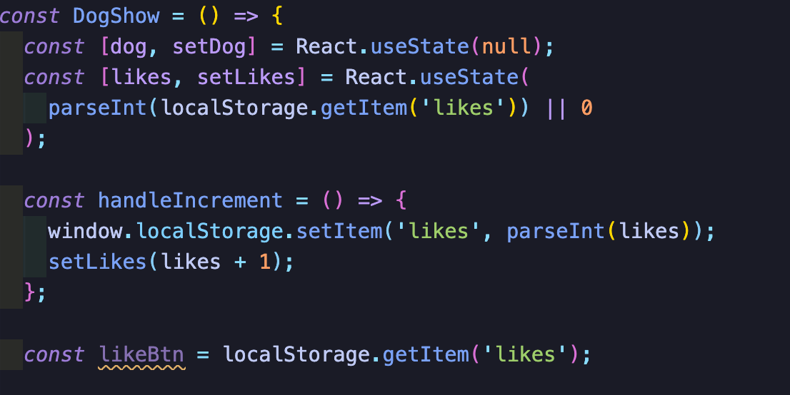

# GA SEI Project 2 : Doggopedia - A React Hackathon Group Project

The second project of the GA Software Engineering Immersive Course.

Link to deployed app: [Doggopedia](https://bit.ly/3Fi0j2g)

## Timeframe

2 days

## Brief

- Consume a public API
- Have several components - At least one classical and one functional
- The app should include a router - with several "pages"
- Be deployed online and accessible to the public

## Techonologies & Tools Used

- JavaScript (ES6)
- React.js
- Git/GitHub
- SCSS
- Bulma CSS Framework
- Axios
- Postman REST Client
- NPM
- react-router-dom
- Netlify

### APIs used:

- TheDogAPI

### A quick look at the App:

---

---

The app is a wikipedia-style project that consists of a homepage. An index page consisting of populated cards accessed from the API via HTTP GET requests using axios that the user can navigate and interact with, along with a search functionality that filters keywords when interacted with. And a single card page that displays data pulled from the public API.

# Tasks

## Planning

After being paired with two of my colleagues, we started initially by bouncing around ideas and ultimately decided on a Dog API. After inspecting the API datasets through Postman, we collectively agreed on creating a wikipedia-style app that displays various information and facts about dogs that users might find useful if they are thinking about ownership.

The API allows us to:

- GET dog images which allowed us to use search and filter functionality
- GET information on different dogs breeds
- GET some fun facts about dogs

For the duration of the project we collectively decided to collaborate together to ensure that we were all working harmoniously with each other. To achieve this, we decided that the best tool to attain the desired level of communication, interaction, and collaboration was Zoom’s conference calls, and Slack, just in case one of us briefly went afk and needed to be contacted directly for anything.

## Day 1

Once we had our game plan set in place, I went to work on building the basic functionality for the site, namely the components required for the site pages. I built the Home, DogShow, DogIndex, and DogCard components, whilst my colleagues added styling using Bulma and Sass, all while ensuring we were continually saving our progress by committing our individual branches to GitHub. This stood us in good stead leading into the following day.

## Day 2

On day 2, we had a website which returned a list of dogs which could be clicked to display more detailed information about each breed. I spent my time testing endpoints in Postman, adding a ‘like button’ feature. This was meant to act as an interactive feature for users of the site to upvote their favourite dogs, it didn’t turn out exactly how I wanted it but I thought the code was interesting enough to leave in the final build of the site, which I’ll explain in more detail below.

## Featured code

Initially I wanted to make an upvote counter for each card in the index, and have that data saved in local storage, I quickly found that this wasn’t so easily done with the chosen API, and my knowledge of the backend was quite limited at this stage, this was to be covered in module 3. So it’s just a button that counts incrementally. I’m a little disappointed with how this turned out but think the functionality is still pretty decent to showcase here.

## Wins

Having a game plan in place from the start was a big advantage for the group, we managed to build 90% of the functionality of the app on the first day which left day 2 to focus on styling, and any extra features we might have otherwise omitted from the final build.

## Challenges

I spent a lot of time trying to get the upvote counter to work with the API but just couldn’t get it to function properly. I do however like the functionality of the code even though it might be a little pointless as it currently is. I may try to implement this functionality in full in a future project.

## Bugs

To the best of my knowledge, there doesn’t seem to be any bugs that have been discovered by myself, or the team. It does take a while for the app to render on screen, but I think that is because Netlify takes a while to warm up.

## Future feature

If given more time I would like to implement a register/login feature to allow users to create accounts on the app, add comments, and to create reviews.

## Key learnings

This was my first group project, and there were a lot of positives taken from it. We all had the same goal, and by working as a team we collectively debugged, pair-programmed, and generally supported each other as we worked on this project. Ultimately this made a positive impact on myself, and I feel I gained some insight into how dev teams in the professional world manage their workload on projects.
